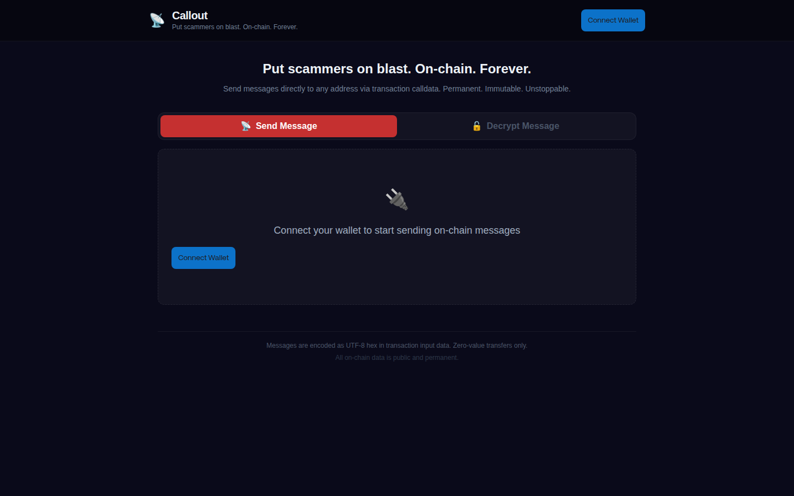

# 📡 Callout

**Put scammers on blast. On-chain. Forever.**



## What It Does

Callout encodes human-readable messages as UTF-8 hex in transaction input data (calldata), then sends a zero-value transaction to the target address. The message becomes permanently recorded on-chain.

### Use Cases
- **Scammer communication** — Send messages to addresses that stole funds
- **On-chain coordination** — Leave permanent, public messages for any address
- **Proof of communication** — Immutable record that a message was sent

## Features

- 🔗 **Wallet Connection** via Reown (WalletConnect) — supports MetaMask, Rainbow, Coinbase, etc.
- 📝 **Pre-written message templates** organized by tone:
  - 🤝 **Cordial** (green) — Professional, assumes good faith
  - ⚠️ **Firm** (yellow) — Assertive with a deadline
  - 🚨 **Hostile** (red) — Maximum pressure, implies consequences
  - ✍️ **Custom** — Write your own
- 😠 **Target Address** — Input with validation
- ↩️ **Return Address** — Auto-injected into templates
- 🔒 **Optional Encryption** — AES-256-GCM encryption with a shared passphrase
- 🔓 **Decrypt Mode** — Decode and decrypt messages from transaction calldata
- ⛽ **Gas Estimation** — See the cost before sending
- 🔍 **Explorer Links** — Direct links to view your transaction

## Supported Networks

- Ethereum Mainnet
- PulseChain
- Polygon
- Arbitrum
- Optimism
- Base
- BSC

## Tech Stack

- React + Vite + TypeScript
- Chakra UI (dark theme)
- viem for blockchain interactions
- Reown/WalletConnect for wallet connection
- Web Crypto API for AES-256-GCM encryption

## Setup

```bash
npm install
npm run dev
```

### Environment Variables

Create a `.env` file:

```
VITE_REOWN_PROJECT_ID=your-project-id-from-cloud.reown.com
```

Get a free project ID at [cloud.reown.com](https://cloud.reown.com).

## How It Works

1. Connect your wallet
2. Enter the target address (scammer/recipient)
3. Choose a message template or write a custom message
4. Optionally encrypt the message with a passphrase
5. Send — the message is encoded as hex calldata in a 0-value transaction
6. The message is now permanently on-chain

### Decrypting Messages

1. Switch to the "Decrypt Message" tab
2. Paste the calldata (input data) from a transaction
3. Click "Decode Message" to see the plaintext
4. If encrypted, enter the passphrase to decrypt

## Domain

[callout.city](https://callout.city)

## License

MIT
