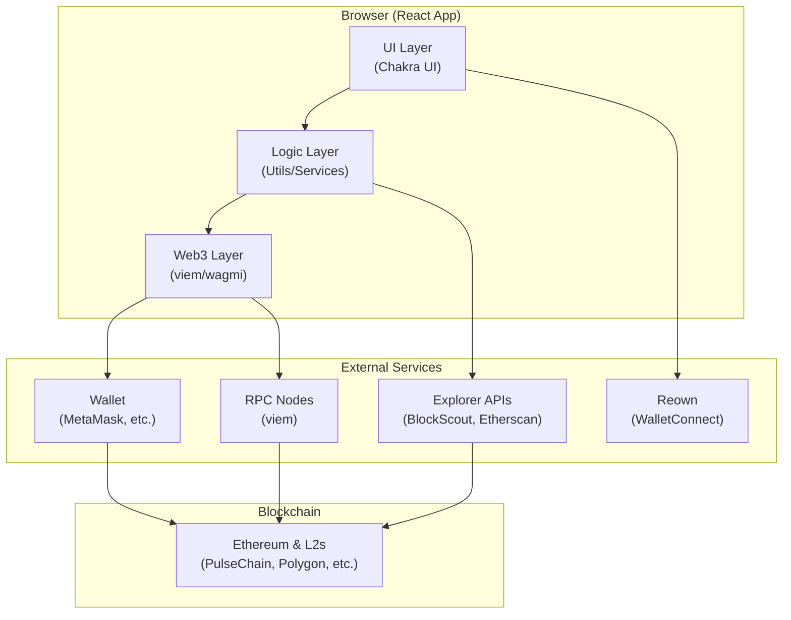
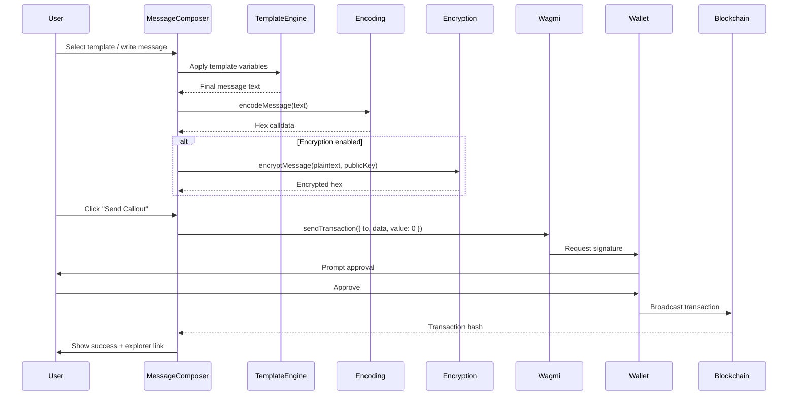
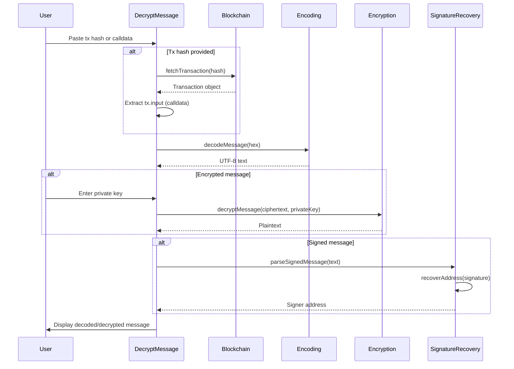
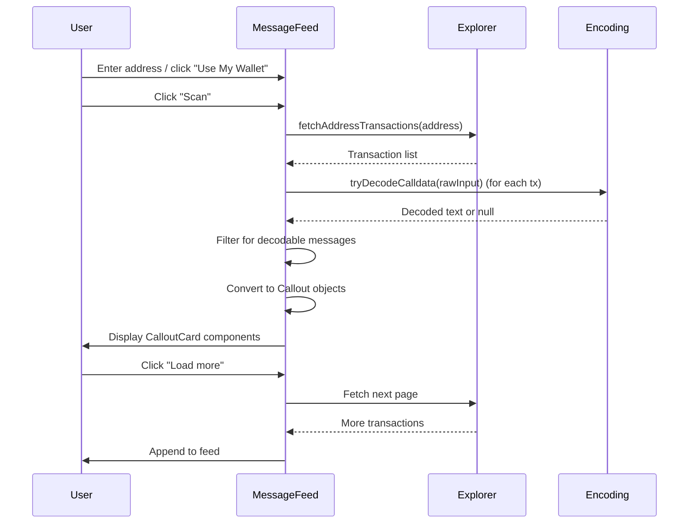
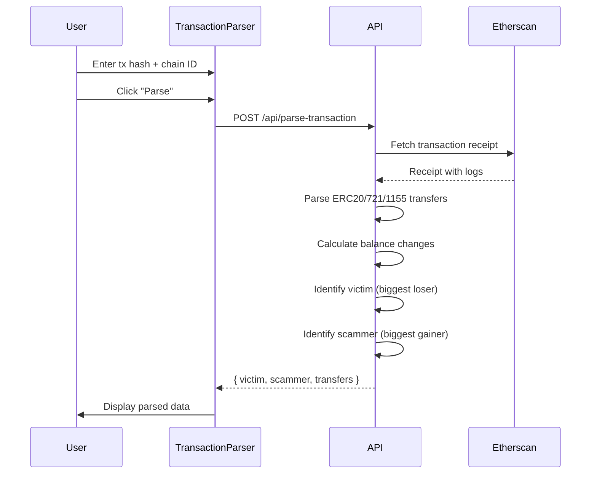

# Codebase Map

> Auto-generated by Cartographer. Last mapped: 2026-02-06T18:18:13Z

## System Overview

Callout is a **fully client-side** decentralized messaging application that enables users to send on-chain messages (callouts) to Ethereum addresses. Messages are encoded as UTF-8 hex in transaction calldata and sent as zero-value transactions, creating permanent, immutable records on the blockchain.



### Technology Stack

- **Frontend Framework:** React 19
- **Build Tool:** Vite 7
- **Language:** TypeScript 5.9
- **UI Library:** Chakra UI 2.x
- **Web3 Library:** viem 2.x + wagmi 3.x
- **Wallet Connection:** Reown AppKit 1.8 (WalletConnect)
- **Encryption:** ECIES (secp256k1) via eciesjs
- **Testing:** Vitest 4.x + Testing Library
- **Package Manager:** Yarn 4 (PnP)
- **Deployment:** Static hosting + Express API (Railway)

## Directory Structure

```
callout/
├── api/                    # Express backend API
│   ├── src/
│   │   └── index.ts        # Transaction parsing endpoint
│   └── package.json
├── docs/                   # Documentation
│   ├── ARCHITECTURE.md     # Technical architecture
│   ├── DEVELOPER.md        # Developer guide
│   ├── USER_GUIDE.md       # User documentation
│   └── ...
├── public/                 # Static assets
├── src/
│   ├── components/         # React components
│   │   ├── batch/          # Batch signing components
│   │   ├── composer/       # Message composition components
│   │   ├── decrypt/        # Decryption UI components
│   │   ├── feed/           # Message feed components
│   │   ├── App.tsx         # Root app component
│   │   ├── MessageComposer.tsx
│   │   ├── DecryptMessage.tsx
│   │   ├── MessageFeed.tsx
│   │   └── ...
│   ├── config/             # Configuration
│   │   ├── web3.ts         # Wagmi/Reown setup
│   │   ├── templates.ts    # Message templates
│   │   ├── theme.ts        # Chakra theme
│   │   └── themeTokens.ts  # Theme tokens
│   ├── services/           # External API services
│   │   ├── blockchain.ts   # viem RPC client
│   │   ├── explorer.ts     # BlockScout API
│   │   └── transactionParser.ts  # Transaction parsing
│   ├── shared/             # Shared components & hooks
│   │   ├── useThemeColors.ts
│   │   ├── ThemedTextarea.tsx
│   │   └── ...
│   ├── types/              # TypeScript types
│   │   └── callout.ts      # Core types
│   ├── utils/              # Utility functions
│   │   ├── encoding.ts     # UTF-8 ↔ hex
│   │   ├── encryption.ts   # ECIES encrypt/decrypt
│   │   ├── templateEngine.ts
│   │   ├── errorHandling.ts
│   │   └── ...
│   ├── App.tsx             # Root component
│   └── main.tsx            # Entry point
├── vite.config.ts          # Vite config + API plugin
├── package.json
└── tsconfig.json
```

## Module Guide

### Core Application

**Entry Point:** `src/main.tsx`
- Initializes React root, providers (Wagmi, Chakra, QueryClient)
- Sets up error boundary and color mode
- Handles unhandled promise rejections

**Root Component:** `src/App.tsx`
- Tab-based navigation (Send, Decrypt, Feed, Batch, Parser)
- Lazy loads tab components for code splitting
- Manages tab state persistence
- Theme-aware styling

**Key Files:**
| File | Purpose | Lines |
|------|---------|-------|
| `src/main.tsx` | Application entry point, provider setup | ~60 |
| `src/App.tsx` | Root component, tab routing | ~370 |
| `src/polyfills.ts` | Browser polyfills (Buffer, etc.) | ~20 |

**Dependencies:**
- React, React DOM
- Chakra UI
- Wagmi, viem
- Reown AppKit

**Dependents:** None (top-level)

---

### Configuration Layer (`src/config/`)

**Purpose:** Static configuration, constants, and setup

**Key Modules:**

#### `web3.ts`
- **Purpose:** Wagmi/Reown configuration, chain definitions, explorer URLs
- **Exports:**
  - `wagmiAdapter` - Wagmi adapter instance
  - `appKit` - Reown AppKit instance
  - `networks` - Supported chain list
  - `explorerUrls` - Block explorer URLs by chain ID
  - `getExplorerTxUrl()` - Generate explorer transaction URL
  - `getExplorerAddressUrl()` - Generate explorer address URL
- **Supported Chains:** Ethereum, PulseChain, Polygon, Arbitrum, Optimism, Base, BSC, and 20+ more
- **Gotchas:** PulseChain (369) is custom-defined, not in viem chains

#### `templates.ts`
- **Purpose:** Message templates organized by tone (Cordial, Firm, Hostile, Custom)
- **Exports:**
  - `messageTemplates` - Template catalog
  - `TemplateCategoryId` - Category types
  - `MessageTemplate` - Template interface
- **Pattern:** Templates use variable substitution (`{{variable}}`)

#### `theme.ts` & `themeTokens.ts`
- **Purpose:** Chakra UI theme configuration
- **Exports:** Theme object, color tokens, spacing, typography, box shadows, gradients
- **Pattern:** Dark-first theme with light mode support
- **Size:** `themeTokens.ts` is ~916 lines (comprehensive token system)
- **Features:** Type-safe color variants, enforced light/dark structure, accent colors, status colors

**Dependencies:** External libraries (Reown, viem chains)
**Dependents:** All components (via imports)

---

### Types Layer (`src/types/`)

**Purpose:** TypeScript type definitions

**Key Files:**

#### `callout.ts`
- **Exports:**
  - `Callout` - Core callout message interface
  - `ChainInfo` - Chain metadata
  - `CHAIN_INFO` - Chain info lookup table
  - `getCalloutTxUrl()` - Generate explorer URLs
- **Pattern:** Uses `readonly` for immutability

#### `appkit.d.ts`
- **Purpose:** Type augmentation for Reown AppKit

**Dependencies:** None
**Dependents:** Components, services, utils

---

### Components Layer (`src/components/`)

**Purpose:** React UI components organized by feature

#### Message Composer (`MessageComposer.tsx` + `composer/`)

**Purpose:** Send Callout tab - compose and send on-chain messages

**Key Components:**
- `MessageComposer.tsx` - Main orchestrator component
- `composer/TemplateSelector.tsx` - Template selection UI
- `composer/TargetAddressInput.tsx` - Address input with parsing
- `composer/VariableForm.tsx` - Template variable inputs
- `composer/MessagePreview.tsx` - Preview final message
- `composer/SendActions.tsx` - Send/sign buttons and actions
- `composer/NetworkSelector.tsx` - Chain selection
- `composer/CustomMessageInput.tsx` - Custom message editor

**State Management:**
- Local state via `useState`
- Persists to localStorage (`callout-composer-state`)
- Uses wagmi hooks for wallet/chain state

**Key Flow:**
1. User selects template or writes custom message
2. Fill variables (if template)
3. Optionally enable encryption
4. Preview message
5. Send transaction via `useSendTransaction()`
6. Show success with explorer link

**Dependencies:** `utils/encoding`, `utils/encryption`, `utils/templateEngine`, `services/blockchain`

#### Decrypt Message (`DecryptMessage.tsx` + `decrypt/`)

**Purpose:** Decrypt tab - decode calldata or fetch tx by hash

**Key Components:**
- `DecryptMessage.tsx` - Main orchestrator
- `decrypt/DecryptInput.tsx` - Input field
- `decrypt/DecodedResult.tsx` - Decoded message display
- `decrypt/DecryptedResult.tsx` - Decrypted message display
- `decrypt/SignatureVerification.tsx` - Signature recovery UI
- `decrypt/TemplateIdentification.tsx` - Template recognition
- `decrypt/TransactionMetadata.tsx` - Transaction info
- `decrypt/ExtractedData.tsx` - Parsed transaction data display
- `decrypt/DecodingAnimation.tsx` - Loading animation
- `decrypt/EncryptedPayload.tsx` - Encrypted payload display
- `decrypt/DecryptError.tsx` - Error display component
- `decrypt/useScrambleText.ts` - Text scrambling animation hook
- `decrypt/animations.ts` - Animation utilities
- `decrypt/extracted/` - Extracted data subcomponents:
  - `ExtractedDataHeader.tsx` - Header for extracted data
  - `ExtractedDataBasicInfo.tsx` - Basic info display
  - `ExtractedAddresses.tsx` - Address extraction display
  - `ExtractedOtherFields.tsx` - Other fields display
  - `DataRow.tsx` - Data row component
  - `TransferTrace.tsx` - Transfer trace visualization
  - `RecoverySteps.tsx` - Recovery steps display
  - `useRecoveryAmounts.ts` - Recovery amounts hook
  - `useSendRecovery.ts` - Send recovery hook

**Features:**
- Auto-detects input type (tx hash vs calldata)
- Fetches transaction from blockchain if hash provided
- Decodes calldata as UTF-8
- Detects encrypted messages
- Recovers signer address from signatures
- Identifies message templates

**Dependencies:** `services/blockchain`, `utils/encoding`, `utils/encryption`, `utils/signatureRecovery`, `utils/templateRecognition`

#### Message Feed (`MessageFeed.tsx` + `feed/`)

**Purpose:** Feed tab - show callouts sent FROM an address

**Key Components:**
- `MessageFeed.tsx` - Main component
- `feed/useMessageFeed.ts` - State management hook
- `feed/CalloutCard.tsx` - Individual callout card

**Features:**
- Search by address
- "Use My Wallet" quick-fill
- Pagination (50 per page)
- Filters for decodable calldata
- Encrypted message detection

**Dependencies:** `services/explorer`, `utils/encoding`

#### Batch Signer (`BatchSigner.tsx` + `batch/`)

**Purpose:** Batch signing tab - send multiple callouts efficiently

**Key Components:**
- `BatchSigner.tsx` - Main component
- `batch/useBatchSigner.ts` - State management hook
- `batch/CSVInput.tsx` - CSV import
- `batch/BatchRowTable.tsx` - Row table UI
- `batch/MessageEditor.tsx` - Per-row message editor
- `batch/ChainSummary.tsx` - Chain grouping summary
- `batch/BatchActions.tsx` - Batch action buttons

**Features:**
- CSV import for bulk addresses
- Per-row message customization
- Chain-aware grouping
- Batch transaction sending

**Dependencies:** `utils/encoding`, `utils/templateEngine`

#### Transaction Parser (`TransactionParser.tsx`)

**Purpose:** Parse theft transactions to identify victim/scammer

**Features:**
- Fetches transaction via API
- Parses ERC20/ERC721/ERC1155 transfers
- Identifies victim (biggest loser) and scammer (biggest gainer)
- Displays transfer breakdown

**Dependencies:** `services/transactionParser`

#### Shared Components

- `Header.tsx` - App header with wallet button
- `Footer.tsx` - App footer
- `WalletButton.tsx` - Wallet connection button
- `ErrorBoundary.tsx` - Error boundary wrapper
- `TemplateSelector.tsx` - Template selection (shared)
- `EncryptionControls.tsx` - Encryption toggle UI

**Dependencies:** Various utils and config
**Dependents:** `App.tsx` (orchestrates)

---

### Services Layer (`src/services/`)

**Purpose:** External API calls and side effects

#### `blockchain.ts`
- **Purpose:** Direct blockchain RPC calls via viem
- **Exports:**
  - `fetchTransaction()` - Fetch tx by hash
  - `isTxHash()` - Validate tx hash format
  - `chains` - Chain registry
- **Pattern:** Caches viem client instances per chain ID
- **Fallback:** Tries multiple chains if chain ID not specified

#### `explorer.ts`
- **Purpose:** BlockScout API calls for address transaction queries
- **Exports:**
  - `fetchAddressTransactions()` - Fetch txs FROM an address
  - `transactionsToCallouts()` - Convert txs to Callout objects
- **Pattern:** Filters for decodable calldata, pagination support
- **Limitation:** Currently only supports PulseChain BlockScout

#### `transactionParser.ts`
- **Purpose:** Parse theft transactions via backend API
- **Exports:**
  - `parseTheftTransaction()` - Parse tx and identify victim/scammer
- **Pattern:** Calls Express API endpoint (keeps Etherscan key server-side)

**Dependencies:** viem, fetch API
**Dependents:** Components (DecryptMessage, TransactionParser, MessageFeed)

---

### Utils Layer (`src/utils/`)

**Purpose:** Pure utility functions (no side effects)

#### `encoding.ts`
- **Purpose:** UTF-8 ↔ hex conversion
- **Exports:**
  - `encodeMessage()` - String → hex calldata
  - `decodeMessage()` - Hex → string
  - `isLikelyText()` - Heuristic to detect text vs contract data

#### `encryption.ts`
- **Purpose:** ECIES encryption (secp256k1)
- **Exports:**
  - `encryptMessage()` - Encrypt with recipient's public key
  - `decryptMessage()` - Decrypt with recipient's private key
  - `isECIESEncrypted()` - Detect ECIES-encrypted data
- **Algorithm:** ECIES via `eciesjs` library
- **Pattern:** Raw hex output (no prefix)

#### `templateEngine.ts`
- **Purpose:** Template variable substitution
- **Exports:**
  - `applyTemplate()` - Replace `{{variables}}` in templates
  - `allVariablesFilled()` - Check if all vars are filled
  - `extractVariables()` - Extract variable names from template

#### `errorHandling.ts`
- **Purpose:** Error classification and retry logic
- **Exports:**
  - `classifyError()` - Categorize errors (NETWORK, USER, etc.)
  - `withRetry()` - Retry logic with exponential backoff
  - `validatePublicKey()` - Validate ECIES public key format
- **Pattern:** User-friendly error messages with actionable steps

#### `signatureRecovery.ts`
- **Purpose:** Recover signer address from message signatures
- **Exports:**
  - `parseSignedMessage()` - Parse "MESSAGE: ... SIGNATURE: 0x..." format
  - `recoverAddress()` - Recover address from signature (EIP-191)

#### `publicKeyRecovery.ts`
- **Purpose:** Recover public key from signatures (for ECIES encryption)
- **Exports:**
  - `recoverPublicKey()` - Recover public key from signature
- **Pattern:** Used for deriving encryption keys from signatures

#### `templateRecognition.ts` & `templateExtraction.ts`
- **Purpose:** Identify and extract data from message templates
- **Exports:**
  - `identifyTemplate()` - Match message to template
  - `extractTemplateData()` - Extract variable values from message

#### `formatting.ts`
- **Purpose:** Address/string formatting utilities
- **Exports:**
  - `truncateAddress()` - Truncate address with ellipsis
  - Other formatting helpers

#### `logger.ts`
- **Purpose:** Centralized logging
- **Exports:**
  - `logError()` - Error logging wrapper

**Dependencies:** viem, eciesjs, Web Crypto API
**Dependents:** Components, services

---

### Shared Layer (`src/shared/`)

**Purpose:** Shared components, hooks, and styles

**Key Files:**
- `useThemeColors.ts` - Theme color hooks (~550 lines - comprehensive color system with type-safe variants)
- `ThemedTextarea.tsx` - Themed textarea component with validation
- `ThemedReadOnlyDisplay.tsx` - Read-only display component
- `CalldataPreview.tsx` - Hex calldata preview component with copy functionality
- `ChainIcon.tsx` - Chain icon component with fallbacks
- `TokenIcon.tsx` - Token icon component
- `SectionLabel.tsx` - Section label component with icon support
- `styles.ts` - Shared style utilities (card styles, etc.)
- `scrollbarStyles.ts` - Custom scrollbar styles for webkit browsers
- `useColorModeWithSystem.ts` - Color mode hook with system preference support

**Dependencies:** Chakra UI
**Dependents:** All components

---

### API Layer (`api/`)

**Purpose:** Express backend API for transaction parsing

**Entry Point:** `api/src/index.ts`

**Endpoints:**
- `POST /api/parse-transaction` - Parse theft transaction, identify victim/scammer
- `GET /api/health` - Health check

**Features:**
- Parses ERC20/ERC721/ERC1155 transfers
- Identifies victim (biggest loser) and scammer (biggest gainer)
- Uses Etherscan unified API (supports multiple chains via `chainid` param)
- Keeps API key server-side (secure)

**Development:** Integrated into Vite dev server via `viteApiPlugin()`
**Production:** Separate Express server (Railway)

**Dependencies:** Express, cors, dotenv
**Dependents:** `services/transactionParser.ts` (client-side)

---

## Data Flow

### Sending a Callout



### Decrypting a Message



### Viewing the Feed



### Parsing Theft Transaction



## Conventions

### Naming Conventions
- **Components:** PascalCase (`MessageComposer.tsx`)
- **Hooks:** camelCase starting with `use` (`useMessageFeed.ts`)
- **Utils:** camelCase (`encoding.ts`, `errorHandling.ts`)
- **Types:** PascalCase interfaces (`Callout`, `ChainInfo`)
- **Constants:** UPPER_SNAKE_CASE (`CHAIN_INFO`, `STORAGE_KEY`)

### File Organization
- **Feature-based:** Components grouped by feature (`composer/`, `decrypt/`, `batch/`)
- **Co-location:** Related files grouped together (components + hooks in same directory)
- **Barrel exports:** Not used (explicit imports preferred)

### Code Patterns
- **Functional components:** No class components
- **Hooks:** Custom hooks for complex state logic (`useBatchSigner`, `useMessageFeed`)
- **Error handling:** Centralized via `errorHandling.ts` with retry logic
- **Type safety:** Strict TypeScript, no `any` types
- **Immutability:** `readonly` properties in types
- **Pure functions:** Utils are pure (no side effects)
- **Services:** Handle side effects (API calls, blockchain reads)

### State Management
- **Local state:** `useState` for component state
- **Wallet state:** Wagmi hooks (`useAccount`, `useChainId`, etc.)
- **No global state:** No Redux/Zustand (wagmi handles wallet state)
- **Persistence:** localStorage for form state (`callout-composer-state`, `callout-tab-state`)

### Styling
- **Chakra UI:** All styles via Chakra components/props
- **No CSS files:** All styles in JS (Chakra + Emotion)
- **Theme tokens:** Centralized in `themeTokens.ts`
- **Color system:** Comprehensive hook system (`useThemeColors.ts`)

### Testing
- **Framework:** Vitest + Testing Library
- **Test files:** Co-located with source (`*.test.ts`, `*.test.tsx`)
- **Coverage:** Utils have good test coverage

## Gotchas

### Encryption
- **ECIES vs AES:** Currently uses ECIES (asymmetric), not AES-256-GCM (documentation may be outdated)
- **Public key format:** Must be uncompressed (65 bytes, starts with `04`)
- **Private key:** Never stored or transmitted (user must provide)

### Transaction Fetching
- **Multi-chain fallback:** `fetchTransaction()` tries multiple chains if chain ID not specified
- **Default chain:** Ethereum mainnet (1) is tried first
- **Error messages:** May be generic if transaction not found on any chain

### BlockScout API
- **PulseChain only:** Feed currently only works with PulseChain BlockScout
- **Rate limits:** No documented limit, but assumed ~10 req/sec
- **Pagination:** Uses `next_page_params` object (not standard offset/limit)

### Template System
- **Variable format:** `{{variableName}}` (double curly braces)
- **Variable extraction:** Regex-based, may fail on complex templates
- **Template recognition:** Heuristic-based matching (not exact)

### Vite API Plugin
- **Development:** API routes handled by Vite plugin (same server)
- **Production:** Separate Express server required
- **Environment:** API key must be in `api/.env` or root `.env`

### Chain Support
- **PulseChain:** Custom-defined (not in viem chains)
- **Explorer URLs:** Hardcoded in `web3.ts` and `callout.ts` (may drift)
- **RPC URLs:** Some chains use public RPCs (may be rate-limited)

### Error Handling
- **Retry logic:** Network errors retried automatically (with backoff)
- **User rejections:** Wallet rejections are not retried
- **Error classification:** Errors categorized for user-friendly messages

### Code Splitting
- **Lazy loading:** Tabs are lazy-loaded (only Decrypt, Feed, Batch, Parser)
- **MessageComposer:** Not lazy-loaded (main tab, always visible)

## Navigation Guide

### To add a new message template:
1. Edit `src/config/templates.ts`
2. Add template to appropriate category
3. Use `{{variable}}` syntax for variables
4. Templates auto-appear in `TemplateSelector`

### To add a new chain:
1. Add chain definition to `src/config/web3.ts` (`networks` array)
2. Add chain to `src/services/blockchain.ts` (`chains` object)
3. Add explorer URL to `src/config/web3.ts` (`explorerUrls`)
4. Add chain info to `src/types/callout.ts` (`CHAIN_INFO`)

### To add a new component:
1. Create file in appropriate feature directory (`composer/`, `decrypt/`, etc.)
2. Export component
3. Import and use in parent component
4. Add types if needed

### To modify encryption:
1. Edit `src/utils/encryption.ts`
2. Update `EncryptionControls.tsx` if UI changes needed
3. Update `DecryptMessage.tsx` if decryption flow changes

### To add a new API endpoint:
1. Edit `vite.config.ts` (dev) or `api/src/index.ts` (prod)
2. Add route handler
3. Create client-side service in `src/services/` if needed
4. Call from component via service

### To modify theme:
1. Edit `src/config/themeTokens.ts` for tokens
2. Edit `src/config/theme.ts` for Chakra theme
3. Use `useThemeColors.ts` hooks in components

### To add error handling:
1. Use `classifyError()` from `utils/errorHandling.ts`
2. Wrap async operations with `withRetry()` if retryable
3. Show user-friendly messages via toast

### To test a component:
1. Create `ComponentName.test.tsx` next to component
2. Use Vitest + Testing Library
3. Run `yarn test` or `yarn test:watch`

### To debug transaction parsing:
1. Check `api/src/index.ts` logs (dev server console)
2. Verify `ETHERSCAN_API_KEY` is set
3. Check Etherscan API response in network tab
4. Verify chain ID matches transaction's chain

### To debug wallet connection:
1. Check Reown project ID (`VITE_REOWN_PROJECT_ID`)
2. Verify wallet is connected (check `useAccount()` hook)
3. Check network/chain ID (`useChainId()`)
4. Review Reown console logs

---

## Key Dependencies

### External Services
- **Reown (WalletConnect):** Wallet connection UI
- **Etherscan API:** Transaction parsing (via backend)
- **BlockScout API:** Address transaction queries (PulseChain)
- **RPC Nodes:** Direct blockchain reads (via viem)

### Critical Environment Variables
- `VITE_REOWN_PROJECT_ID` - Reown project ID (required)
- `ETHERSCAN_API_KEY` - Etherscan API key (for transaction parsing)

### Build & Deploy
- **Development:** `yarn dev` (Vite dev server + API plugin)
- **Production:** `yarn build` (static build) + Express API server
- **Deployment:** Railway (frontend + API)

---

**Last Updated:** 2026-02-06T18:18:13Z
**Maintainer:** See `docs/DEVELOPER.md` for contribution guidelines
